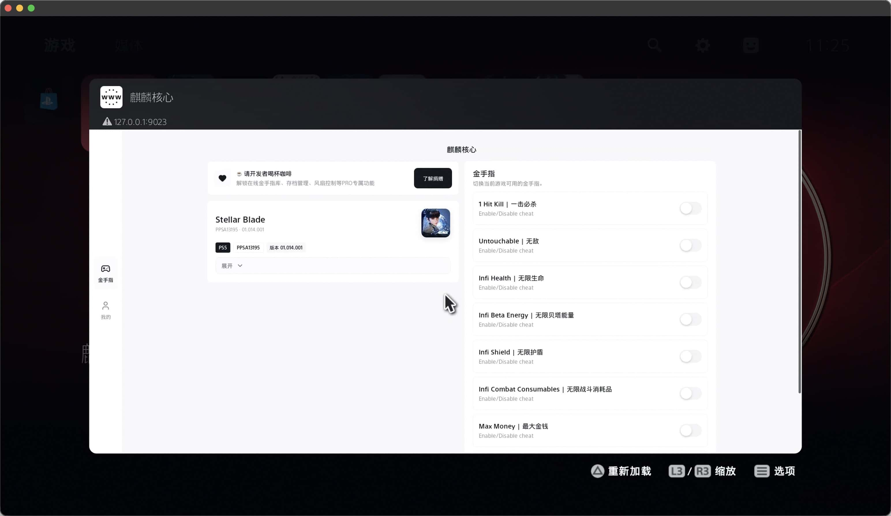

# Kylin Core（麒麟核心）


[English](../README.md) | **简体中文**

一款 PS5 自制金手指加载器与实时游戏修改工具，专为 PlayStation 5 自制生态系统打造。

[](https://github.com/aydencharles/kylin-core-release/releases/latest)
[](../LICENSE)
[-brightgreen)]()

## 预览

<p align="center">
  
</p>

## 功能特性

1. **实时作弊开关** — 游戏中随时启停作弊功能，修改即时生效
2. **多格式支持** — 支持 `.shn` / `.mc4` / `.json` 格式的金手指文件，统一扁平目录管理
3. **自动检测游戏** — 无需手动输入 Title ID，工具自动识别当前运行的游戏
4. **单工具解决方案** — 无需额外模块，无需 `ps5debug-NG`，无其他依赖
5. **稳定游戏内运行** — APR 游戏不会出现卡死
6. **简洁目录结构** — 将金手指文件放入 `/data/kylin/cheats` 即可

## 兼容性

- PS4 游戏（在 PS5 上运行）：✅ 支持
- PS5 原生游戏：✅ 支持
- 带 APR 保护的 PS5 游戏：✅ 支持
- 系统固件：兼容已破解的 PS5，固件版本 **4.xx 至 12.xx**
- 金手指格式：`.shn` · `.mc4` · `.json`

## 安装

详见 [`guide/installation.md`](./guide/installation.md)

### 快速开始

1. 将 `kylin-core.elf` 和 `.pkg` 文件复制到 U 盘
2. 通过 [PS5 Payload Manager (PLDMGR)](https://github.com/itsPLK/ps5-payload-manager) 加载 `kylin-core.elf`
3. 通过 **设置 → 调试设置** 安装 `.pkg`
4. 从主屏幕启动 **Kylin Core**

> [!IMPORTANT]
> 必须先通过 PLDMGR 加载，否则 UI 可能无法正常显示。

## 使用方法

```
1. 启动你的游戏
2. 从 PS5 主屏幕打开 Kylin Core
3. 工具自动检测当前运行的游戏
4. 根据需要开关作弊功能
5. 返回游戏 — 修改即时生效
```

## 金手指目录

所有金手指文件存放于 `/data/kylin/cheats`。

- 将所有金手指文件直接放入此目录
- 不支持子文件夹 — 仅支持扁平结构

## 已知问题

- 部分金手指依赖于特定的系统固件版本
- 金手指的实际效果取决于其实现质量
- 必须先通过 PLDMGR 加载，再启动 UI

## 赞助

<a href="https://ko-fi.com/0xp0co"></a>

如果您觉得这个项目对您有所帮助，请考虑支持它的持续开发。感谢您的支持！

## 致谢

- [PS5 Payload Manager (PLDMGR)](https://github.com/itsPLK/ps5-payload-manager)：PS5 ELF 加载器
- [PS5 Payload SDK](https://github.com/ps5-payload-dev/sdk)：开源 SDK，让 PS5 payload 开发成为可能
- PS5 自制社区 — 漏洞研究者、SDK 维护者以及 payload 加载器作者

## 开源许可

本项目基于 [MIT License](../LICENSE) 许可。
